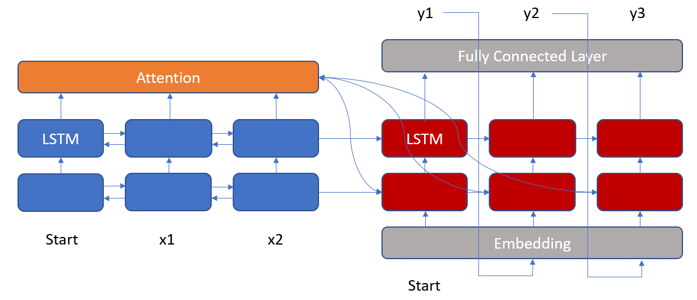

# Trajectory Classification

## Task Description

The dataset consists of flight trajectories, where each trajectory can consist of more than 1 pattern.

The image shows a trajectory containing more than 1 pattern. The first pattern is from Singapore to Jeddah and the second pattern is using the flight pattern Singapore to Christchurch. In this dataset, a trajectory can contain a maximum of 2 patterns. Each trajectory consists of many points, where a point represents a signal.

The task is to use a model to accurately predict the label for each point in every trajectory.

## Model

The model used is a bidirectional encoder-decoder model. In this repository, the number of layers are tunable.

The model must be able to correctly predict the transition point between points as well as the label for each point.

## Workflow

With reference to the image representing the workflow above, docker will be used to contain the annotator, database and model containers. Data will be synthesised in the model container, which will be stored in the database container. The model in the model container will retrieve the corresponding data from the database container, train and make predictions. The predictions, together with the actual data from the database container, will be fed into the annotator container for visualisation on the front-end for stakeholders.

## Input/ Output

The inputs will be sql tables. The Entity Relationship (ER) diagram below shows how the sql tables are connected to one another and the tables following it contain a brief description of each column.

The output will be the updated sql tables with predicted labels and they will be passed into the database container for storage, as well as the front-end for visualisation. 

## How to use 

Step 1: Load the real data (in sql format) in the db folder.

Step 2: Change the name of the sql file in the dockerfile in the db folder.

Step 3: Go to db/setup.sql, change the name 'datay.sql' at the last line to your file name.

Step 4: Load the original data source for the synthetic dataset. Put the csv file in model/src/synthetic. Download the data [here](https://drive.google.com/file/d/1PZTzZqASYjrBuaprladVAgvQZyjqlmG9/view?usp=sharing). Please do not change the name of the file.

Step 5: docker-compose up. (sudo docker-compose up)

Step 6: Run the db image. (sudo docker run -d task1_db)

Step 7: Run the model image. 

(sudo docker run --link id_of_db_container_from_step_4:db --runtime nvidia -v absolute_path_in_local_machine:/src task1_model). 

An example of the absolute_path_in_local_machine is /home/dh/Documents/flights/'task 1'/model/src.

Step 8: Run the annotator image to visualise on the front-end. 

(sudo docker run --link id_of_db_container_from_step_4:db -p 8050:8050 task1_annotator)
